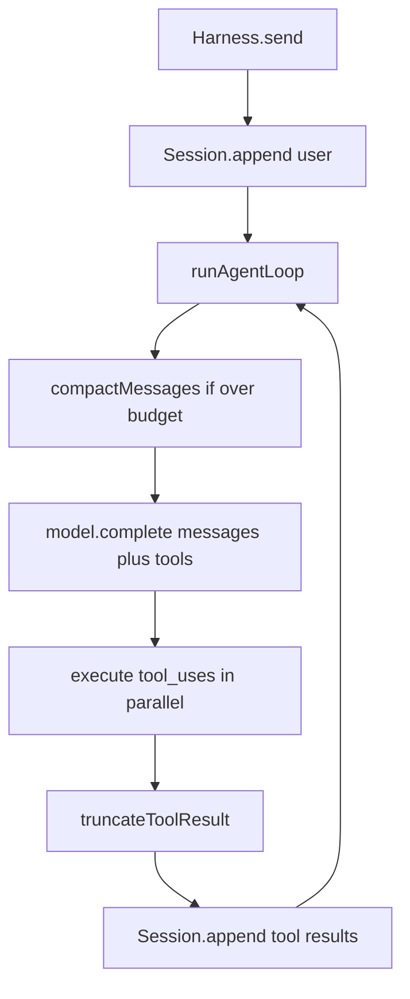

# MXPF AI Harness — Token & Throughput Optimizations (v0.2)

**Date:** 2026-08-21  
**Branch:** `feat/optimizations`  
**Status:** Draft for review  

## Problem

Every `send()` turn today:

1. Resends **all** session messages to the model (`SessionStore.getMessages()` unmodified).
2. Resends **all** tool schemas (builtins + every MCP tool) via `ToolRouter.listDefinitions()`.
3. Stores **uncapped** tool outputs (Read whole files, Bash up to 2MB, MCP text as-is).
4. Executes tool calls **sequentially**.
5. Uses non-streaming `complete()` with no provider prompt-cache hints.
6. Sync-rewrites the full pretty-printed session JSON on every `append()`.

Long AARIA-style resumes + MCP fleets make prompt tokens grow roughly with turn count × history size, while wall time is dominated by serial tools and large requests.

## Goals (balanced v0.2)

| Goal | Success signal |
|------|----------------|
| Cut input tokens on long sessions | Compaction keeps model-visible context under a configured budget; older turns become a summary |
| Cap tool-result bloat | No single tool result exceeds a char budget in session/model history |
| Faster multi-tool turns | Independent tool calls in one assistant step run concurrently |
| Cheaper stable prefixes | Anthropic/OpenRouter cache headers on system + tools when supported |
| Measurable | Unit tests for caps/compaction/parallelism; usage events still accurate |

**Non-goals for v0.2:** token-level model streaming API redesign, subagents, hooks, dynamic tool discovery UI, changing public `AriaAgent` surface beyond consuming new `HarnessOptions`.

## Defaults (opt-in where risky)

New `HarnessOptions.context` / `HarnessOptions.throughput` (names below). Defaults favor **safe savings without surprising quality loss**:

| Knob | Default | Notes |
|------|---------|--------|
| `context.toolResultMaxChars` | `32_000` | Per tool_result string before truncation marker |
| `context.bashMaxChars` | `32_000` | Also lower Bash `maxBuffer` alignment in builtins |
| `context.readDefaultMaxChars` | `100_000` | Soft cap when Read omits limit (truncate with notice) |
| `context.maxInputChars` | `undefined` (off) | When set, compact before `complete` if estimated chars exceed |
| `context.keepRecentTurns` | `6` | After compaction: keep last N user/assistant/tool rounds verbatim |
| `throughput.parallelTools` | `true` | `Promise.all` for tool_uses in one turn |
| `throughput.promptCache` | `true` | Emit cache headers / `cache_control` when provider supports |
| `model.maxOutputTokens` | Anthropic keep 8192 unless overridden; OpenAI send when set | Configurable on `ModelRef` or options |

Compaction **off** until `maxInputChars` is set (or a convenience `context.autoCompact: true` that sets a sensible default budget, e.g. `200_000` chars). Recommendation for AARIA: enable `autoCompact: true` when wiring mxpf.

## Architecture



### 1. Tool-result budgets

- New helper `truncateToolResult(text, maxChars)` → truncated body + `\n\n[truncated: kept N of M chars]`.
- Apply in `runAgentLoop` **before** `session.append` and before `tool.result` event payload (or emit full to events optionally — prefer truncated for consistency).
- Builtin Read/Bash: enforce caps at source in `builtins.ts` so disk/process work can also stop early where cheap (Bash still may produce up to buffer; then truncate).

### 2. Context compaction

- New module `src/context/compact.ts`:
  - `estimateChars(messages)` — sum text / tool_result / tool_use JSON lengths (good enough; no tokenizer dependency in v0.2).
  - `compactMessages(messages, { maxInputChars, keepRecentTurns, systemPrompt? })`:
    - If under budget, return as-is.
    - Else: keep first system-equivalent content untouched (system is separate today); keep last `keepRecentTurns` “rounds”; replace middle with a single synthetic user message:
      `[context summary]\n...` produced by a **local extractive summary** first (concatenate truncated older text / tool names), with optional **model summary** hook later — v0.2 ships **extractive** only to avoid nested `complete` cost/latency by default.
  - Persist compacted view: either rewrite session messages via `setMessages` after compact, or keep dual store. **Decision:** compact a **view** for the model call only; optionally persist compacted history when `context.persistCompaction: true` (default `false`) so resume stays lossless unless opted in.

**v0.2 decision:** model sees compacted view; session file remains full history unless `persistCompaction: true`. Avoids data loss on resume by default.

### 3. Parallel tools

- In `loop.ts`, replace serial `for` with:
  - Emit all `tool.start`
  - `await Promise.all` execute (+ permission check per tool)
  - Emit `tool.result` in original tool_use order
  - Build one `role: "tool"` message preserving order
- Abort: if `signal` aborts, reject outstanding work where possible; still respect CancelledError.

### 4. Prompt cache headers

- **Anthropic:** mark `system` and tools block with `cache_control: { type: "ephemeral" }` where API shape allows (stable prefix).
- **OpenAI / OpenRouter:** send `HTTP-Referer` / `X-Title` (already partially done); add OpenRouter `cache` or provider-specific fields only when documented — if unsupported, no-op.
- Do not invent fake caching; feature-detect by provider.

### 5. Configurable max output tokens

- Add `maxOutputTokens?: number` on model options; Anthropic uses it instead of hardcoded 8192; OpenAI sends `max_tokens` / `max_completion_tokens` when set.

### 6. Session I/O (light)

- Debounce or async `persist()` (write after loop turn or coalesced 50ms) — secondary; include if cheap. Prefer: persist still sync at end of each user `send()` and after each full tool batch, but skip pretty-print (`JSON.stringify` without `null, 2`) to cut I/O size/CPU.

## Public API additions

```ts
export type ContextOptions = {
  toolResultMaxChars?: number;      // default 32000
  bashMaxChars?: number;            // default 32000
  readDefaultMaxChars?: number;     // default 100000
  maxInputChars?: number;           // compact when estimate exceeds
  autoCompact?: boolean;            // sets maxInputChars to 200_000 if unset
  keepRecentTurns?: number;         // default 6
  persistCompaction?: boolean;      // default false
};

export type ThroughputOptions = {
  parallelTools?: boolean;          // default true
  promptCache?: boolean;            // default true
};

// on HarnessOptions:
context?: ContextOptions;
throughput?: ThroughputOptions;

// on ModelRef:
maxOutputTokens?: number;
```

`supports("observability")` remains false; emit optional `status` events: `context.compacted`, `tool.truncated` for debugging.

## Events

- `{ type: "status", status: "context", detail: "compacted …" }` when compaction runs
- Existing `usage` unchanged (still sum of provider-reported tokens)

## Testing

- Unit: truncate helper boundaries; compact under/over budget; parallel tools preserve order; Anthropic request includes cache_control when enabled
- No network in unit tests (mock `ModelClient` / fetch)

## Rollout

1. Ship in `mxpf-ai-harness` 0.2.0 on `feat/optimizations`
2. AARIA mxpf adapter: pass `context: { autoCompact: true }` and keep throughput defaults
3. Document knobs in README + CHANGELOG

## Risks

| Risk | Mitigation |
|------|------------|
| Compaction drops needed detail | Lossless session by default; tune `keepRecentTurns` / budget |
| Parallel tools race on shared cwd files | Document; same risk as any agent; order of results still stable |
| Cache headers break a provider | Gate by provider; ignore unknown fields |
| Truncation hides errors | Keep last 2KB of truncated content + head so error tails survive |

## Out of scope (later)

- Model-based summarization pass
- Streaming token deltas from providers
- Lazy MCP tool schema loading / tool search
- Prompt token estimators per model tokenizer
